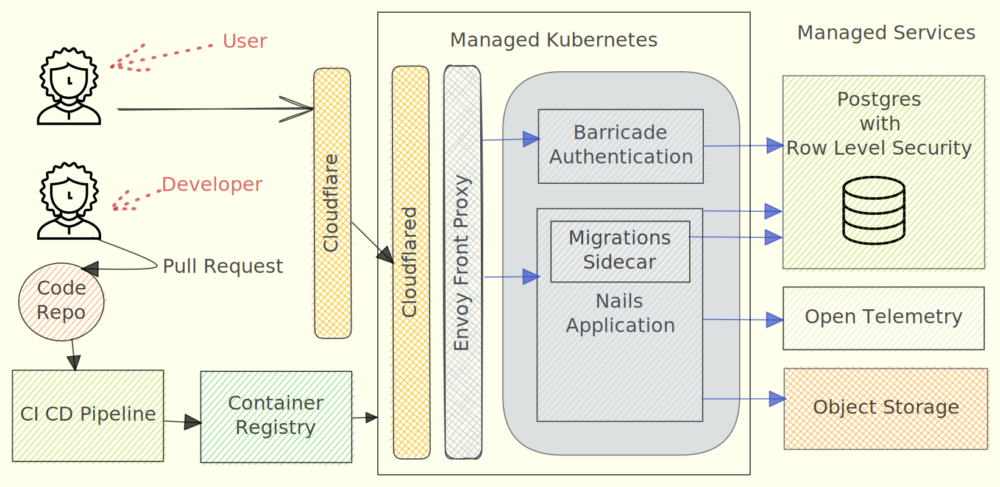

# BETHer

Start a complete BETH (Bun + Elysia + Turso + Htmx) worklfow template, from development to deployment, based in [create-beth-app](https://github.com/ethanniser/the-beth-stack) by [ethanniser](https://github.com/ethanniser) and [Rust on Nails](https://rust-on-nails.com/) by [purton-tech](https://github.com/purton-tech);

## Architecture
### BETH Stack
* Bun;
* Elysia;
* Turso;
* Htmx;
* Lucia
* UnoCSS
* drizzle
* hyperscript
* fly.io

### Rust on Nails Workflow
Based in the following architecture used in [Rust on Nails](https://rust-on-nails.com/):

     

### HDA (Hypermedia Driven Application)
Based in [HDA (Hypermedia Driven Application)](https://htmx.org/essays/hypermedia-driven-applications/) architecture, as described by Carson Gross, Adam Stepinski and Deniz Akşimşek in their [book](https://hypermedia.systems/book/contents/);

### The 12 Web Principles
Based on [The 12 Web Principles](https://12factor.net/) by [Adam Wiggings](https://adamwiggins.com/) checklist:

1) ✅ **Codebase:** Codebase must be a repository with version control accessed by many developers.
2) ✅ **Dependencies:** Dependencies must be declared in a manifest file.
3) ✅ **Config:** Configs must be described in environment or config files.
4) ✅ **Backing Services:** Services must be isolated in containers. 
5) ✅ **Build, Release, Run:** Deployment process must be divided in build, release and run.
6) ✅ **Processes:** Application must be stateless, never saving states or files.
7) ✅ **Port Bind:** Services must be exposed via port binding.
8) ✅ **Concurrency:** Scale horizontally by adding containers, vm or physical machines.
9) ✅ **Disposability:** Process must have fast startup and graceful shutdown.
10) ✅ **Dev/Prod Parity:** Environments must be divided in Dev, Prod, Staging, etc.
11) ✅ **Logs:** Logs must be events streams via stdout instead of files.
12) ✅ **Admin Process:** Admin process must be run isolated.

### Minimal virtualized setup
You only need [Git](https://git-scm.com/) and [Docker](https://www.docker.com/) to start a complete BETH workflow.

### Infrastructure as Code
Automated infrastructure as code using [Pulumi](https://www.pulumi.com/) and [Kubernetes](https://kubernetes.io/)